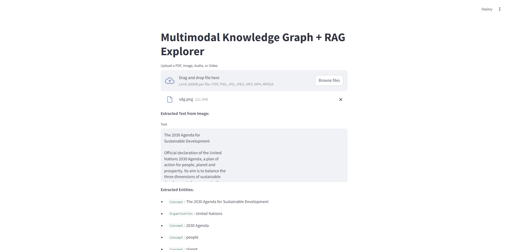
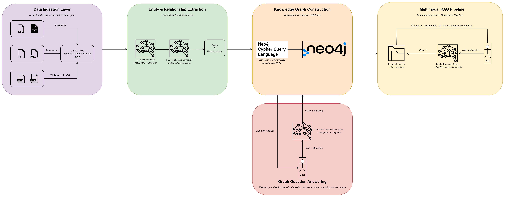

# Multimodal Knowledge Graph & RAG Pipeline for HR Content Understanding
This project is a 72-hour technical challenge that implements a multimodal pipeline capable of ingesting text, extracting knowledge, and enabling intelligent search using Retrieval-Augmented Generation (RAG). It uses cutting-edge tools like LangChain, OpenAI, and Neo4j to build a searchable knowledge graph from unstructured documents like employee handbooks.



## Overview and Background

This multimodal system demonstrates an end-to-end pipeline that ingests and processes diverse data formats including text, images, audio, and video. Each input is transformed into unified text using tools like PyMuPDF, Tesseract, and Whisper, with videos further enriched through key frame extraction and captioning via LLaVA. Extracted text is passed through LLMs to identify entities and relationships, which are then structured into a Neo4j knowledge graph using Python-generated Cypher queries.

Once the knowledge graph is built, the system enables two complementary question-answering modes. The first uses a semantic RAG pipeline to retrieve and answer user queries by searching indexed documents. The second leverages graph-based QA by translating natural language questions into Cypher to query Neo4j directly. This combination allows users to gain insights from multimodal data through both unstructured and structured retrieval.



## Table of Contents
```
multimodal-rag-kg/
|__ images/
|   |__ app.png
|   |__ workflow.png
|__ data/
|   |__ sdg.mp3
|   |__ sdg.mp4
|   |__ sdg.pdf
|   |__ sdg.png
|__ src/
|   |__ ingestion/
|   |   |__ pdf_loader.py
|   |   |__ audio_loader.py
|   |   |__ frame_extractor.py
|   |   |__ image_loader.py
|   |   |__ video_loader.py
|   |__ extraction/
|   |   |__ entity_extractor.py
|   |__ graph/
|   |   |__ graph_writer.py
|   |   |__ relation_inferencer.py
|   |__ rag/
|   |   |__ graph_qa.py
|   |   |__ vector_indexer.py
|   |__ vision/
|   |   |__ llava_captioner.py
|__ .env
|__ main.py
|__ app.py
|__ README.md
|__ requirements.txt
```

## Getting started

### Installing
The project is deployed in a local machine, so you need to install the next software and dependencies to start working:

1. Create and activate the new virtual environment for the project

```bash
conda create --name full_stack_multimodal 
conda activate full_stack_multimodal
```

2. Clone repository

```bash
git clone https://github.com/rafamartinezquiles/full-stack-multimodal.git
```

3. In the same folder that the requirements are, install the necessary requirements

```bash
cd full-stack-multimodal
pip install -r requirements.txt
```


### Setup
To run this project successfully, follow these setup steps carefully:

#### Configure your .env file
At the root of the project, edit the .env file and ensure it includes the following environment variables:

```bash
OPENAI_API_KEY=your_openai_api_key
NEO4J_URI=your_neo4j_uri
NEO4J_USERNAME=your_neo4j_username
NEO4J_PASSWORD=your_neo4j_password
```

- **OpenAI API Key:** Required for all LLM-based tasks. Get yours from [OpenAI](https://platform.openai.com/api-keys)
- **Neo4j Credentials:** 
    1. Create a free account at [Neo4j Aura](https://login.neo4j.com/u/signup/identifier?state=hKFo2SBIZnpjXzJJZGlCSkY2aHFnVEQ5OWNLcVd4QVZtdGg2VaFur3VuaXZlcnNhbC1sb2dpbqN0aWTZIDN1TkxVWExQWHRDcVVHQXBXcXdyTXZfR2hvcWNUX0pro2NpZNkgV1NMczYwNDdrT2pwVVNXODNnRFo0SnlZaElrNXpZVG8)
    2. Use default cloud provider/region.
    3. Once your instance is created, click “Connect” → “Drivers” to retrieve your URI, username, and password.


Another thing to do in case you are on Windows is to go to the following [link](https://github.com/UB-Mannheim/tesseract/wiki) and install the Tesseract library on your computer. Once that is done, take note of the location of the *tesseract.exe* application, and inside the *image_loader.py* file located in *src/ingestion*, modify the following line:

```bash
pytesseract.pytesseract.tesseract_cmd = "your_path"
```

Finally, you’ll need to visit the following [link](https://www.gyan.dev/ffmpeg/builds/) to download the latest version of FFmpeg. This step is essential because Whisper, the tool used for transcribing audio, depends on FFmpeg to process audio files. If FFmpeg is not installed or properly configured on your system, Whisper will throw an error.

After downloading, unzip the compressed folder to a location of your choice (e.g., C:\ffmpeg). Once extracted, you must add the FFmpeg binary directory to your system's PATH so that it can be accessed globally from any terminal or application.

Follow these steps to add FFmpeg to your system environment variables:

1. Open the Start Menu and search for Environment Variables.

2. Click on "Edit the system environment variables".

3. In the window that appears, click the "Environment Variables..." button.

4. Under the System variables section, find and select the variable named Path, then click Edit.

5. Click New, and add the following path (assuming this is where you unzipped FFmpeg):

```bash
C:\ffmpeg\bin
```
 6. Click OK on all open dialogs to save the changes.

 Once this is done, FFmpeg will be properly installed and ready to use by Whisper or any other software that depends on it.
